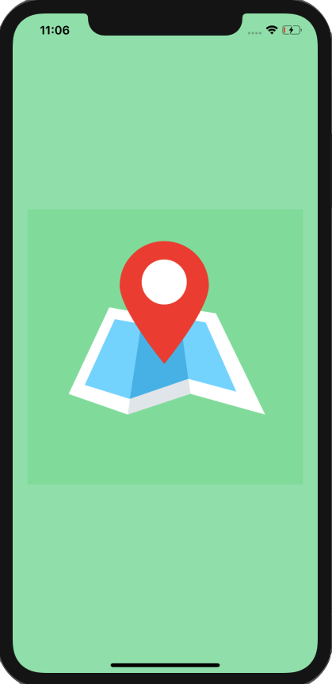
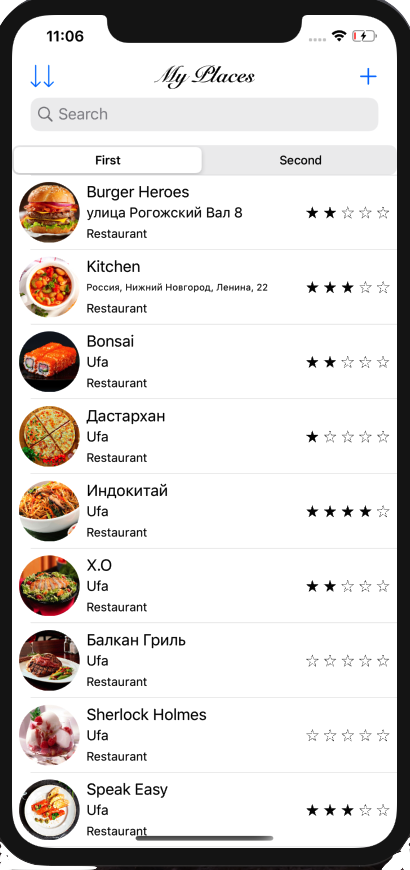

# MyPlaces

Application within the course swiftbook.ru.

Мои места.

Приложение в рамках курса swiftbook.ru.

https://youtu.be/dllJXl8LRfI

Used:
- Swift
- CocoaPods
- Protocols
- Extension
- MapKit
- WebKit
- CoreLocation
- Realm
- DispatchQueue
- Autolayout
- MVC
- Interface Builder
- Storyboard/Xib
- Localizable

UIKit:
- UITabBarController
- UIViewController
- UIStoryboardSegue
- UIStoryboardUnwindSegueSource
- UITableViewController
- UITableViewCell
- UISearchController
- UIAlertController
- UIBarButtonItem
- UIImagePickerController

Foundation:
- Timer
